  <picture>
    <source media="(prefers-color-scheme: dark)" srcset="./assets/banner-dark.svg">
    <source media="(prefers-color-scheme: light)" srcset="./assets/banner-light.svg">
    
  </picture>

 

## whoami

I work the seam between Figma and production. I design AI-native products and ship them myself as clean, fast React, so the thing people use is the thing that was designed, pixel for pixel.

They call me **One-Done**: get it right, and get it out.

> I care about products people genuinely adopt, not ones they get adapted to.

 

## what i'm building

**Sapling CRM** &middot; Founding Design Engineer &middot; the AI-native CRM for nonprofit fundraisers.

Third hire, owning the product end to end: brand, design system, and production React across **11+ surfaces**. Along the way I built a Claude Code and Figma MCP pipeline that cut my design-to-code time by **70%**, so one person ships the surface area of a team.

I do my best work in **0 to 1**, ambiguous, high-ownership rooms where the pattern hasn't been figured out yet.

 

## selected work

| | what it was | the dent |
|---|---|---|
| **Sapling CRM** `2026` | AI-native nonprofit CRM, designed and built end to end | 11+ surfaces shipped solo, design-to-code time down 70% |
| **HypdVision** `2022 &rarr; 2024` | B2B influencer-marketing platform, founding designer, 0 to 1 | 250+ brands, 100K+ creators in 7 months, setup time down 40% |
| **AWII Chatbot** `2024 &rarr; 2025` | Redesigned ASU's water AI companion for 10K+ Arizonans | engagement up 33%, feature discoverability up 60% |
| **ClanX** `2022` | Rebuilt a tech-hiring brand into a fast, credible site | helped fill 150+ roles and close $4M+ in salaries |

More, with case studies, at **[vandangohil.com](https://vandangohil.com)**.

 

## the toolbox

**Design** &nbsp;Figma &middot; Motion &middot; design systems &middot; prototyping  
**Build** &nbsp;React &middot; Next.js &middot; TypeScript &middot; Tailwind &middot; Supabase  
**Workflow** &nbsp;Claude Code &middot; Figma MCP &middot; Vercel

 

## a few wins

`UX Spark Hackathon Winner` &nbsp; `Best Student Contributor` &nbsp; `Social Innovator, Intel` &nbsp; `ASU OpenDoor Leader`

 

   
  <a href="https://vandangohil.com"><b>portfolio</b></a>
  &nbsp;&middot;&nbsp;
  <a href="https://www.linkedin.com/in/vandangohil"><b>linkedin</b></a>
  &nbsp;&middot;&nbsp;
  <a href="mailto:onedone.product@gmail.com"><b>email</b></a>
    
  designed and shipped by one-done

