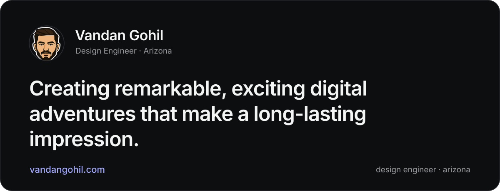
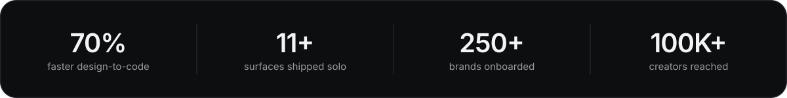

  <picture>
    <source media="(prefers-color-scheme: dark)" srcset="./assets/banner-dark-v2.svg">
    <source media="(prefers-color-scheme: light)" srcset="./assets/banner-light-v2.svg">
    
  </picture>

 

## whoami

I live in the gap between design and engineering. I design AI-native products in Figma and ship them myself as clean, fast React, so what people use is exactly what was designed, down to the pixel.

They call me **One-Done**: get it right, then get it out.

> I care about products people genuinely adopt, not ones they get adapted to.

 

  <picture>
    <source media="(prefers-color-scheme: dark)" srcset="./assets/metrics-dark-v2.svg">
    <source media="(prefers-color-scheme: light)" srcset="./assets/metrics-light-v2.svg">
    
  </picture>

 

## what i'm building

**[Sapling CRM](https://saplingcrm.org)** is the AI-native CRM for nonprofit fundraisers. I'm the third hire and its founding design engineer, owning the product end to end: brand, design system, and production React across 11+ surfaces. The Claude Code and Figma MCP pipeline I built cut my design-to-code time by **70%**, so one person ships the surface area of a team.

I do my best work in **0 to 1**, ambiguous, high-ownership rooms where the pattern hasn't been figured out yet.

 

## selected work

| project | what it was | the dent it made |
|---|---|---|
| [**Sapling CRM**](https://vandangohil.com/sapling-crm) | AI-native nonprofit CRM, designed and built end to end | 11+ surfaces shipped solo, design-to-code time down 70% |
| [**HypdVision**](https://vandangohil.com/hypdvision) | B2B influencer-marketing platform, founding designer, 0 to 1 | 250+ brands, 100K+ creators in 7 months, setup time down 40% |
| [**AWII Chatbot**](https://vandangohil.com/awii-chatbot) | Redesigned ASU's water AI companion for 10K+ Arizonans | engagement up 33%, feature discoverability up 60% |
| [**ClanX**](https://vandangohil.com/clanx) | Rebuilt a tech-hiring brand into a fast, credible site | helped fill 150+ roles and close $4M+ in salaries |

Full case studies at **[vandangohil.com](https://vandangohil.com)**.

 

## the toolbox

**Design & prototyping** &nbsp;Figma · Framer · ProtoPie · Webflow · v0 · Photoshop · After Effects  
**Development** &nbsp;React · Next.js · TypeScript · JavaScript · HTML/CSS · Supabase · REST APIs · Git  
**AI workflows** &nbsp;Claude Code · Figma MCP · Design.md pattern · Vercel  
**Research & craft** &nbsp;Design systems · Information architecture · Interaction design · Data visualization · Accessibility · User research · Usability & A/B testing · Rapid prototyping

 

## a few wins

`UX Spark Hackathon Winner` &nbsp; `Best Student Contributor` &nbsp; `Social Innovator, Intel` &nbsp; `ASU OpenDoor Leader`

 

  <a href="https://vandangohil.com"><b>portfolio</b></a>
  &nbsp;·&nbsp;
  <a href="https://www.linkedin.com/in/vandangohil"><b>linkedin</b></a>
  &nbsp;·&nbsp;
  <a href="mailto:onedone.product@gmail.com"><b>email</b></a>
    
  designed and shipped by one-done

